# Proyecto 1

## Nombre de la materia: Intercomunicación y seguridad en redes
## Alumno: Brayan Blancas Monsalvo
## Matricula: 201965973
## Docente: Josué Pérez Romero


# *Introducción*

El propósito principal de este proyecto es comprender las bases de diferentes mecanismos de seguridad usados en las redes de comunicación y en otros ámbitos, como lo es el cifrado simetrico, firmas digitales e integridad y autenticación.

El desarrollo muestra fragmentos de código de cada una de las actividades solicitadas, capturas de pantalla para mostrar el resultado y de explicaciones acerca de ciertos procedimientos. 

La conclusión concentra el aprendizaje obtenido al finalizar las tres actividades, expresando la importancia de estos conceptos en entornos reales.

Finalmente, se incluye un enlace al repositorio con el código fuente.

# *Desarrollo*

## 1. Cifrado simétrico:
Implementan o utiliza una pequeña librería para simular el cifrado y descifrado de un mensaje corto usando un algoritmo simple por flujo (como el XOR con una clave) o por bloques (simulando AES con una librería si usas C++ o Python)

__Demostración:__ Cifrar un mensaje con una clave y mostrar que solo el poseedor de la clave puede leerlo.

### Código 

Se definieron dos funciones: xor_encryp y xor_decrypt. 

```python
def xor_encrypt(message, key):
    message_encrypted = "".join(
        map(
            lambda ch: chr(ord(ch[1]) ^ ord( key[ch[0] % len(key)] ))
            , 
            enumerate(message)
        )
    )

    return message_encrypted

def xor_decrypt(ciphertext, key):
    return xor_encrypt(ciphertext, key)

```

### *xor_encrypt*
La función xor_encryp recibe el mensaje y la clave para cifrar. Dentro del map se aplica la operación XOR (^) a cada letra del mensaje con una letra de la clave. La letra de la clave con la que se aplica el XOR se calcula mediante la operación módulo. Por ejemplo, el mensaje es 'hola' y mi clave es 'si', y se quiere aplicar XOR a la letra 'a' del mensaje con su correspondiente letra de la clave, se aplica un módulo entre el índice de la letra del mensaje % la longitud de la clave, quedando algo asi:

|Letra mensaje | Módulo | Letra clave |
|--------------|-------------|-|
|  h [0] | 0 % 2 = 0 | s [0] |
| o [1] | 1 % 2 = 1 | i [1] |
| l [2] | 2 % 2 = 0 | s [0] |
| a [3] | 3 % 2 = 1 | i [1] | 

De esta manera, se garantiza que cada letra de la clave se asigne de manera 'circular' a cada letra del mensaje.

Cabe aclarar que no se trata directamente con las letras de las clave y el mensaje, sino con su valor unicode (retorna un entero) con la función ord(), de esta manera se puede usar la operación XOR, ya que Python permite operaciones entre bits directamente con enteros. 

Finalmente con los enteros Unicode encriptados, se convierten nuevamente en una cadena con su respectivo caractes que representa dicho número.


### *xor_decrypt*

Para calcular el mensaje original, se aplica nuevamente la función XOR al mensaje encriptado con la misma clave. 

### Demostración

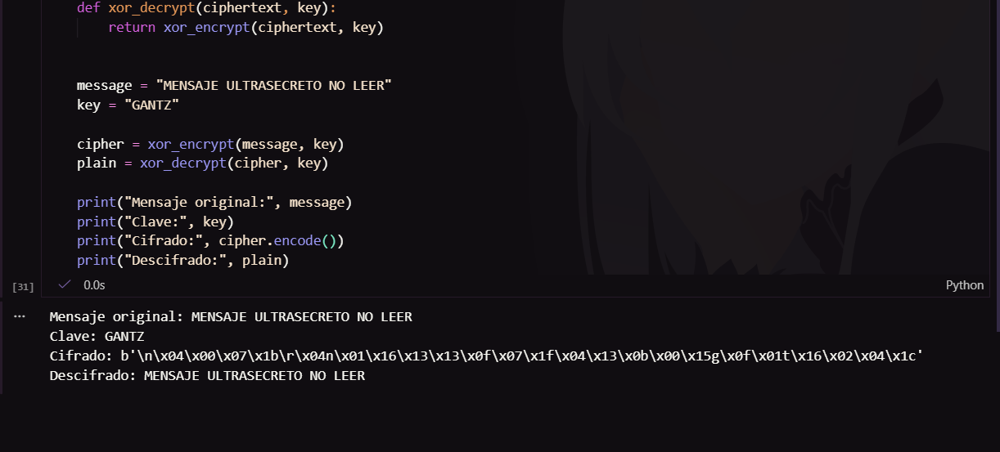

El mensaje imprime incluso los caracteres que no se pueden imprimir (con .encode()). Para mejorar la presentación se puede mostrar en hexadecimal.

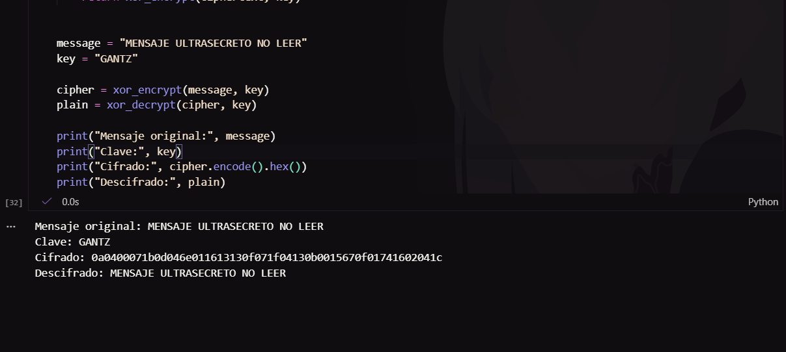

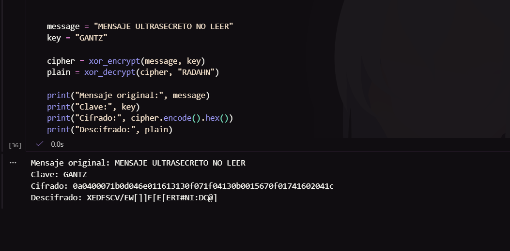

Si se trata de desencriptar con una clave incorrecta, el mensaje original no se puede obtener.


## 2. Funciones Hash y MAC (Integridad y Autenticación):
Utiliza una función Hash (ej. SHA-256) para calcular la huella digital de un archivo de texto. 

__Simula un ataque de integridad:__ Modifica el archivo de texto en un solo byte y recalcula el hash para demostrar como cambia drásticamente.


### Función HASH

Para mostrar la huella digital de un archivo, se puede usar la función Get-FileHash de PowerShell que por defecto calcula el hash con el algoritmo SHA256.

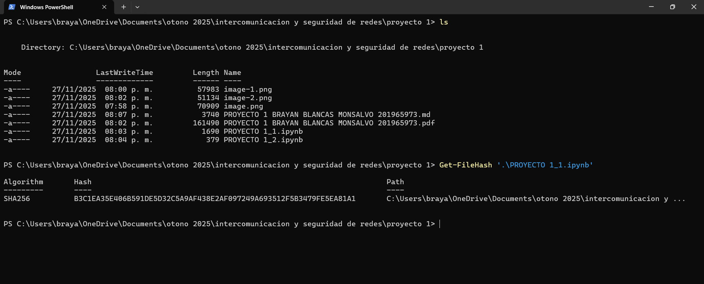
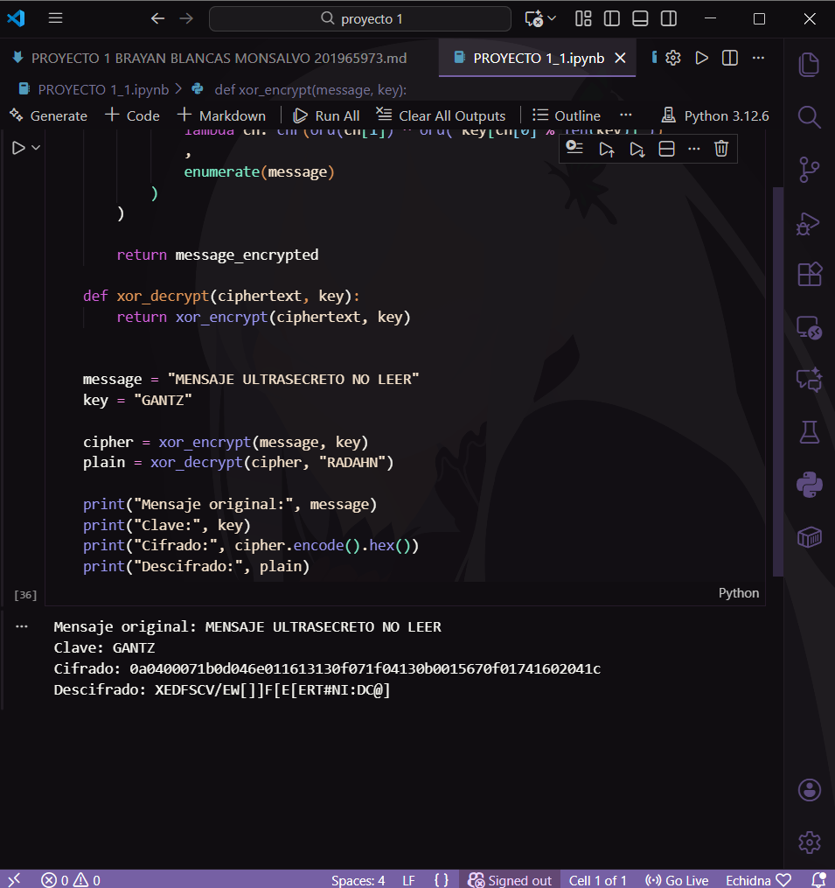

Al realizar cualquier modificación, el hash cambia drásticamente. 

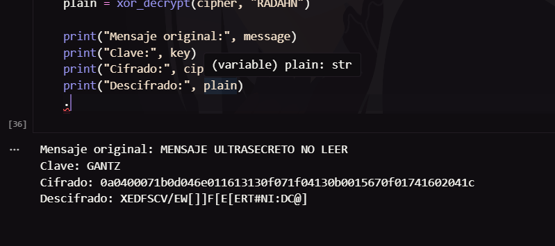
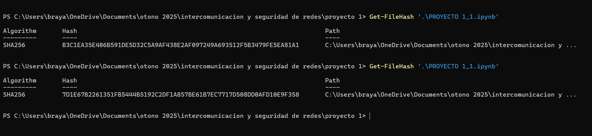


Implementa un MAC (Message Authentication Code): Usa una clave compartida con la función hash (HMAC) para demostrar que se necesita tanto la clave como el mensaje para verificar la integridad y la autenticidad del remitente.

### Código

El código es muy simple, se requiere calcular el hmac (con el módulo hmac y hashlib de Python) pasando los bytes del mensaje y la clave. Con el hash calculado se 'envia' y el receptor lo recibe. Después trata de verificar que el mensaje es autentico y no esta alterado. Para ello vuelvo a aplicar el hmac con el mensaje recibido + la clave que él y el emisor conocen. Si ambas HMAC coinciden el mensaje no fue alterado.  

```python
import hmac
import hashlib

mensaje = b"Mensaje importante"
clave_compartida = b"clave_secreta"

hmac_generado = hmac.new(clave_compartida, mensaje, hashlib.sha256).hexdigest()
print("HMAC generado:", hmac_generado)

hmac_verificacion = hmac.new(clave_compartida, mensaje, hashlib.sha256).hexdigest()

if hmac_generado == hmac_verificacion:
    print("MENSAJE VERIFICADO")
else:
    print("MENSAJE ALTERADO")

```

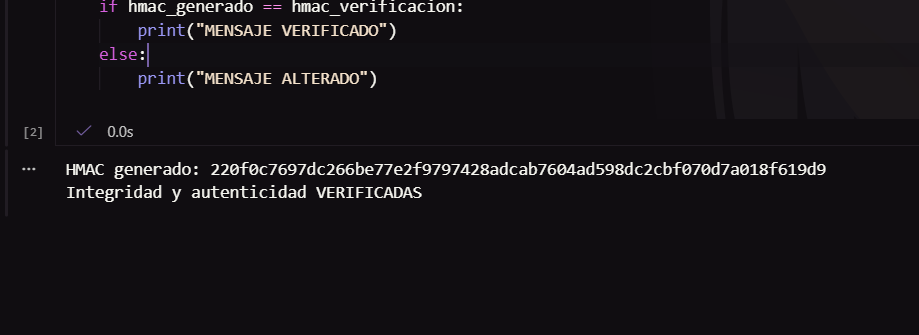

Si el hash no coincide. 

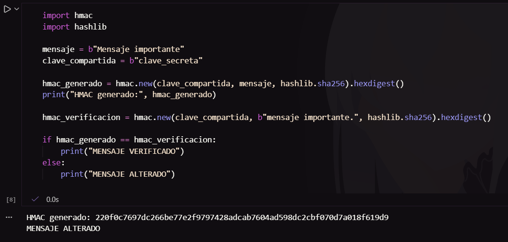


## 3. Firma digital (No repudio):
Investiga una libreria para generar una pareja de claves asimétricas (RSA o ECDSA).

__Simulación de firma:__ Firma el hash del mensaje usando la clave privada y permite que cualquiera verifique la firma con la clave pública. Muestra como esto garantia el No Repudio.

Openssl es una herramienta de código abierto, entre muchas de sus caracteristicas, permite cifrar, descrifrar, firmar y verificar archivos y mensajes con RSA.

### 1. Crear una clave privada

RSA requiere de dos claves, una pública y otra privada. Con openssl se puede crear una clave pública a traves de una clave privada

```bash
openssl genrsa -out private_key.pem 2048
```
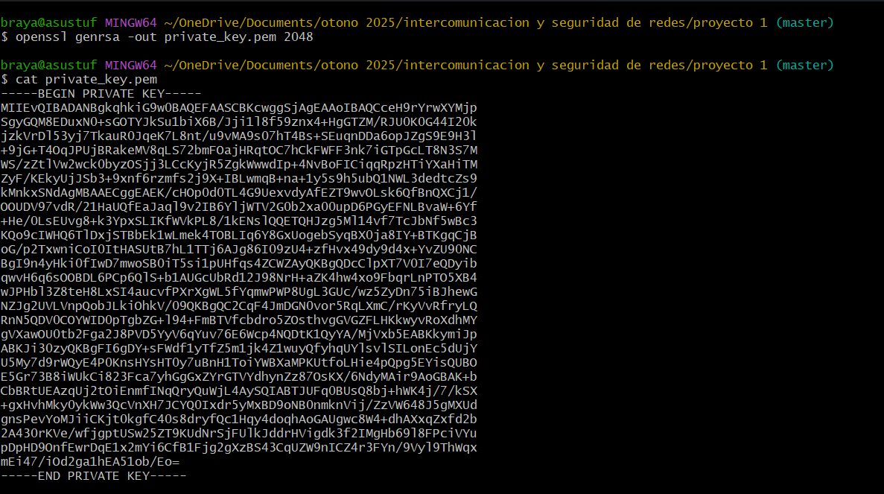

### 2. Crear una clave pública a partir de una clave privada

```bash
openssl rsa -in  private_key.pem -pubout -out public_key.pem
```

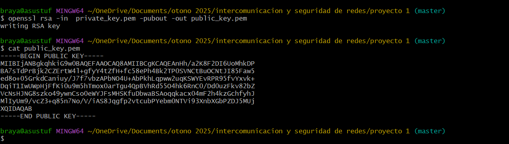

### 3. Calcular y firmar el hash del mensaje

```
openssl dgst -sha256 -sign private_key.pem -out firma.bin mensaje.txt
```

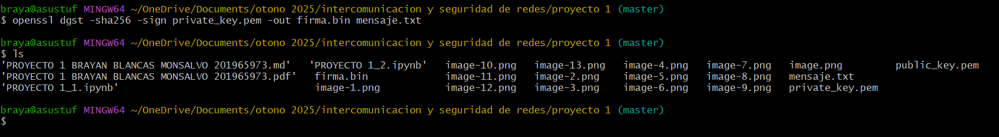

### 4. Verificar la firma

```bash
openssl dgst -sha256 -verify public_key.pem -signature firma.bin mensaje.txt
```

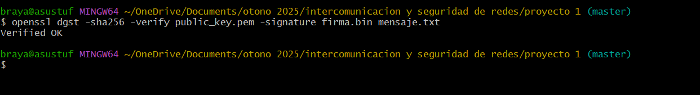


# *Conclusión*

Con estas tres actividades se demostraron los pilares de la criptografía y como estas trabajan en conjunto para garantizar la seguridad en la comunicación. La primera actividad mostró el cifrado simetrico y como solo quieren poseen la clave puede leer el contenido original. La segunda actividad demostró cómo las funciones hash son extremandamente sensibles al más mínimo cambio, y esto se aprovecha para garantizar que el contenido de un mensaje/archivo es autentico y no sufrió alguna alteración. Finalmente con la tercera actividad se generó una clave privada y clave pública, además se mostró que aquellos mensajes firmados con la clave original pueden ser verificados con su clave pública generada. 

Estos conceptos en conjunto son la base de las comunicaciones, transacciones bancarias, validación de software, documentos legales digitales y una larga lista. A pesar de que las actividades se realizaron de manera simplificada, muestra los principios que protegen millones de interacciones en la red. 

# *Enlace de GitHub*

