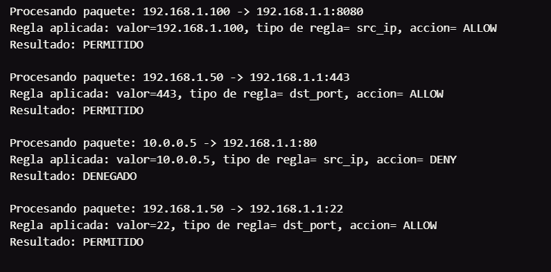
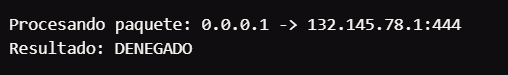
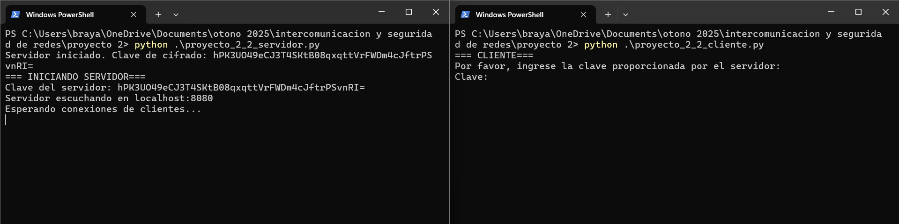
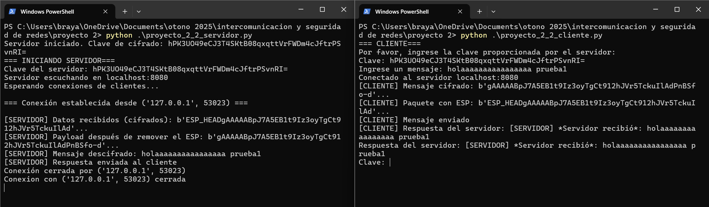
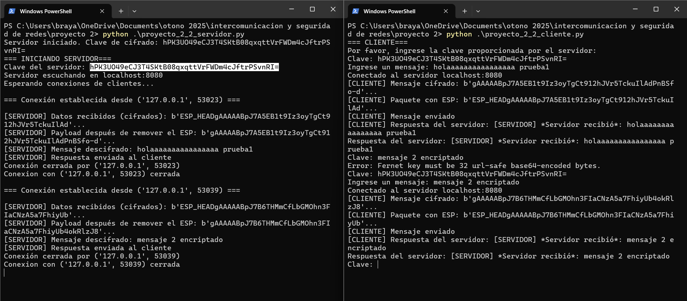
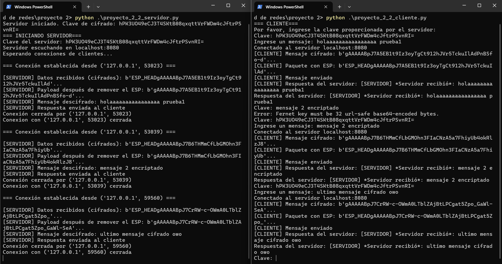
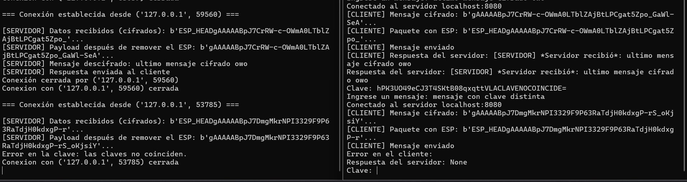

# Proyecto 2

## Nombre de la materia: Intercomunicación y seguridad en redes
## Alumno: Brayan Blancas Monsalvo
## Matricula: 201965973
## Docente: Josué Pérez Romero

# *Introducción*
La idea central del trabajo fue desarrollar como primera actividad un programa que simule el funcionamiento básico de un firewall, que es como un guardia de seguridad para una red, decidiendo qué tráfico puede pasar y qué tráfico debe ser bloqueado. La segunda actividad tiene como propósito simular un tunel VPN que encripta los mensajes entre un cliente y un servidor.

Se detalla el funcionamiento de las clases y sus correspondientes métodos. Además se realizan las pruebas y se muestra la evidencia del correcto funcionamiento.

Finalmente, se coloca la conclusión y el aprendizaje al realizar el proyecto, así como se adjunta un enlace del repositorio con el código fuente.

# *Desarrollo* 
## 1. Simulación de Filtrado de paquetes (Firewall 7.4.1)

- Escribir un programa que simule un *firewall* de capa de red. Define una lista de reglas (ACL):
    - Permitir tráfico desde IP X
    - Denegar tráfico al puerto Y
    - Regla por defecto: Denegar todo
- El programa debe simular la llegada de un paquete (con IP de origen, IP de destino y puerto) y determinar si se permite o deniega.

### Programa

La clase principal Firewall cuenta con una lista de reglas (inicialmente vacía) además de dos funciones: add_rule y process_packet. 

```python
class Firewall:
    def __init__(self):
        
    def add_rule(self, value, rule_type, action="DENY"):
    
    def _matches_rule(self, rule, src_ip, dst_ip, dst_port):
```

### *add_rule*
La función add_rule permite insertar reglas al firewall indicando el valor (ya sea de la dirección IP o puerto), el tipo de regla (de tipo src_ip o dst_port) y la acción a realizar (DENY o ALLOW).

```python
    def add_rule(self, value, rule_type, action="DENY"):
        if(self.rules.get(value) != None):
            print("Esa regla ya existe!")

        self.rules.update({value : [rule_type, action] })
```

### *process_packet*
La función process_packet permite determinar si un paquete es denegado o procesado. Recibe una dirección IP de origen, destino y puerto. Internamente retorna la acción a tomar (True para permitir o False para denegar) según una regla establecida. En caso de no encontrar una regla (self.rules.get(value) == None) retorna False.

```python
    def process_packet(self, src_ip, dst_ip, dst_port):
        print(f"Procesando paquete: {src_ip} -> {dst_ip}:{dst_port}")
        
        if (self.rules.get(src_ip) != None):
            print(f"Regla aplicada: valor={src_ip}, tipo de regla= {self.rules.get(src_ip)[0]}, accion= {self.rules.get(src_ip)[1]}")

            return True if self.rules.get(src_ip)[1] == "ALLOW" else False
        elif (self.rules.get(dst_port) != None):
            print(f"Regla aplicada: valor={dst_port}, tipo de regla= {self.rules.get(dst_port)[0]}, accion= {self.rules.get(dst_port)[1]}")

            return True if self.rules.get(dst_port)[1] == "ALLOW" else False
        
        return False
```

### *Funcionamiento*

Se indican una serie de reglas al firewall.

```python
    firewall = Firewall()
    
    firewall.add_rule('192.168.1.100', 'src_ip', 'ALLOW')
    firewall.add_rule('22', "dst_port", 'ALLOW')
    firewall.add_rule('443', "dst_port", 'ALLOW')
    firewall.add_rule('10.0.0.5', 'src_ip', 'DENY')
```

Finalmente, se observa el resultado del procesamiento de los paquetes.



Si se procesa un paquete con dirección IP o puerto sin regla establecida, se denega el paquete.

```python
result5 = firewall.process_packet("0.0.0.1", "132.145.78.1", "444")`
```



## 2. Implementación de un Tunel Sencillo

- Crea dos programas (Cliente y Servidor) que se comuniquen a través de sockets (C++ o Python).
- Implementación del Túnel: Haz que el cliente cifre le mensaje (payload) y añada un encabezado simulado (como el ESP) antes de enviarlo. El servidor debe descifrar el mensaje después de eliminar el encabezado.
- Nota: Esto no es IPSec real, simo una simulación conceptual del proceso de encapsulación y cifrado del tráfico dentro de un túnel VPN.

### Programa del servidor
La clase TunnelServer del servidor cuenta con cuatro atributos: host, port, key y un objecto de tipo Fernet para cifrar y descifrar, además de cinco funciones: start, handle_client, remove_esp_header, add_esp_header y get_key.

```python
class TunnelServer:
    def __init__(self, host='localhost', port=8080):
        self.host = host
        self.port = port
        self.key = Fernet.generate_key()
        self.cipher = Fernet(self.key)
    
    def start(self):
    
    def handle_client(self, client_socket, addr):
    
    def remove_esp_header(self, data):
    
    def add_esp_header(self, data):

    def get_key(self):
```

El servidor usa el modulo cryptography.fernet para su funcionamiento. Fernet permite generar una clave y cifrar datos con ella. Dicha clave debe compartirse con el cliente para que cliente y servidor compartan la misma clave y puedan comunicarse correctamente. 

### *start*
La funcion start iniclaliza el servidor con el host y puerto indicado en la funcion __init__. Pone al servidor a la escucha de clientes que quieran conectarse y cuando se realiza una conexión, la acepta y crea un hilo para atender al cliente. La función que se encarga de antender a los clientes es *handle_client*.

```python
def start(self):
        with socket.socket(socket.AF_INET, socket.SOCK_STREAM) as server_socket:
            server_socket.bind((self.host, self.port))
            server_socket.listen()
            print(f"Servidor escuchando en {self.host}:{self.port}")
            print("Esperando conexiones de clientes...")
            
            while True:
                client_socket, addr = server_socket.accept()
                print(f"\n=== Conexión establecida desde {addr} ===")
                
                client_thread = threading.Thread(
                    target=self.handle_client, 
                    args=(client_socket, addr)
                )
                client_thread.start()
```

### *handle_client*
La función handle_client guarda los datos recibidos del cliente. Remueve el payload del paquete y desencripta los datos recibidos. Al finalizar le regresa un mensaje al cliente mostrando el mensaje que recibió. En caso de que las claves usadas entre servidor y cliente para cifrar y descrifrar las claves sean distintas, se capta la excepción y se imprime en pantalla el error. 

```python
    def handle_client(self, client_socket, addr):
        try:
            while True:
                encrypted_data = client_socket.recv(1024)
                if not encrypted_data:
                    print(f"Conexión cerrada por {addr}")
                    break
                
                print(f"\n[SERVIDOR] Datos recibidos (cifrados): {encrypted_data[:50]}...")
                
                payload = self.remove_esp_header(encrypted_data)
                print(f"[SERVIDOR] Payload después de remover el ESP: {payload[:50]}...")
                
                decrypted_message = self.cipher.decrypt(payload)
                print(f"[SERVIDOR] Mensaje descifrado: {decrypted_message.decode()}")
                
                response = f"[SERVIDOR] *Servidor recibió*: {decrypted_message.decode()}"
                encrypted_response = self.add_esp_header(
                    self.cipher.encrypt(response.encode())
                )
                client_socket.send(encrypted_response)
                print(f"[SERVIDOR] Respuesta enviada al cliente")
        except InvalidToken as token:
            print(f"Error en la clave: las claves no coinciden. {token}")
        except Exception as e:
            print(f"Error en manejo de cliente {addr}: {e}")
        finally:
            client_socket.close()
            print(f"Conexion con {addr} cerrada")
```

### *remove_esp_header*

La función retorna el payload sin el ESP. Hace uso del array slicing para dividir el array de caracteres recibidos. El "encabezado ESP" es una cadena de 8 caracteres, siendo 'ESP_HEAD' (para simular el encabezado ESP real). La intrucción [8:] indica que se quieren tomar solamente los caracteres desde el indice 8 en adelante.

```python
def remove_esp_header(self, data):
        return data[8:]
```

### *add_esp_header*
La función add_esp_header agrega el encabezado ESP simulado al mensaje que envia el servidor al cliente.

```python
def add_esp_header(self, data):
        esp_header = b"ESP_HEAD"
        return esp_header + data
```

### *get_key*

La función get_key retorna la clave aleatoria generada por el módulo Fernet.

```python
    def get_key(self):
        return self.key
```

### Programa del cliente

La clase TunnelClient cuenta con cuatro funciones: set_key, send_message, add_esp_header y remove_esp_header y tres atributos: server_host, server_port y clipher. El atributo cipher almacenará la instancia de Fernet.

```python
class TunnelClient:
    def __init__(self, server_host='localhost', server_port=8080):
        self.server_host = server_host
        self.server_port = server_port
        self.cipher = None

    def set_key(self, key):

    def send_message(self, message):

    def add_esp_header(self, data):
    
    def remove_esp_header(self, data):
```
### *set_key*

La función set_key inicializa la instancia de Fernet pasando como argumento la clave a utilizar para cifrar y descifrar los mensajes.

```python
    def set_key(self, key):
        self.cipher = Fernet(key)
```

### *send_message*

La función send_message se conecta mediante sockets al servidor con la direccion y puerto indicado, cifra el payload, añade el encabezado ESP (simulado mediante un string de 8 caracterees 'ESP_HEAD'), envia el payload y espera por una respuesta. Finalmente imprime el mensaje recibido en la terminal.

```python
    def send_message(self, message):
        if not self.cipher:
            raise ValueError("Clave de cifrado no establecida. Use set_key() primero.")
        
        try:
            with socket.socket(socket.AF_INET, socket.SOCK_STREAM) as client_socket:
                client_socket.connect((self.server_host, self.server_port))
                print(f"Conectado al servidor {self.server_host}:{self.server_port}")
                
                encrypted_payload = self.cipher.encrypt(message.encode())
                print(f"[CLIENTE] Mensaje cifrado: {encrypted_payload[:50]}...")
                
                tunnel_packet = self.add_esp_header(encrypted_payload)
                print(f"[CLIENTE] Paquete con ESP: {tunnel_packet[:50]}...")
                
                client_socket.send(tunnel_packet)
                print(f"[CLIENTE] Mensaje enviado")
                
                response = client_socket.recv(1024)
                decrypted_response = self.cipher.decrypt(
                    self.remove_esp_header(response)
                )
                print(f"[CLIENTE] Respuesta del servidor: {decrypted_response.decode()}")
                
                return decrypted_response.decode()
                
        except ConnectionRefusedError:
            print("Error: No se pudo conectar al servidor")
        except Exception as e:
            print(f"Error en el cliente: {e}")
```

### *add_esp_header*

La función add_esp_header es exactamente la misma en el servidor. Añade al payload una cadena de ocho caracteres para simular el encabezado ESP.

```python
    def add_esp_header(self, data):
        esp_header = b"ESP_HEAD"
        return esp_header + data
```

### *remove_esp_header*

La función remove_esp_header funciona exactamente como en el servidor. Elimina la cabecera ESP del payload.

```python
    def remove_esp_header(self, data):
        return data[8:]
``` 

### *main*

La función main crea una instancia de TunnelClient, entra en un ciclo while infinito y pide constantemente la clave para encriptar. Dicha clave la proporciona el servidor, solicita un mensaje mediante terminal y lo manda al servidor. Si la clave entre el cliente y servidor es la misma, el servidor retorna el mensaje que recibió del cliente.

```python
def main():
    client = TunnelClient()
    
    print("=== CLIENTE===")
    print("Por favor, ingrese la clave proporcionada por el servidor:")
    
    while True:
        try:
            key_input = input("Clave: ").strip()
            client.set_key(key_input.encode())

            msg = str(input("Ingrese un mensaje: "))

            response = client.send_message(msg)
            time.sleep(2)
             
            print(f"Respuesta del servidor: {response}")

        except KeyboardInterrupt:
            print("\nCliente terminado por el usuario")
        except Exception as e:
            print(f"Error: {e}")
```

### Funcionamiento
Al iniciar ambos programas, el servidor imprime la clave para encriptar y el cliente solicita una clave.



Al ingresar la clave y el mensaje a enviar, el servidor imprime el mensaje recibido y retorna dicho mensaje de vuelta al cliente.







En caso de que la clave no coincida. 




# *Conclusión*

Un firewall es una herramienta de vital importancia en el ámbito de la seguridad en redes, ya que permite bloquear el tráfico potencialmente malicioso restringiendo los paquetes que se reciben de X dirección IP o puerto en específico. 

Una VPN es una gran opción para garantizar mayor seguridad en una red, ya que permite "crear" un tunel donde los datos viajan cifrados, garantizando que solamente aquellos a quienes va dirigidos la información puedan leerla y no terceras personas con intenciones maliciosas.

# *Enlace de GitHub*

https://github.com/brayan-monsalvo4/proyectos-inter/tree/master/proyecto%202